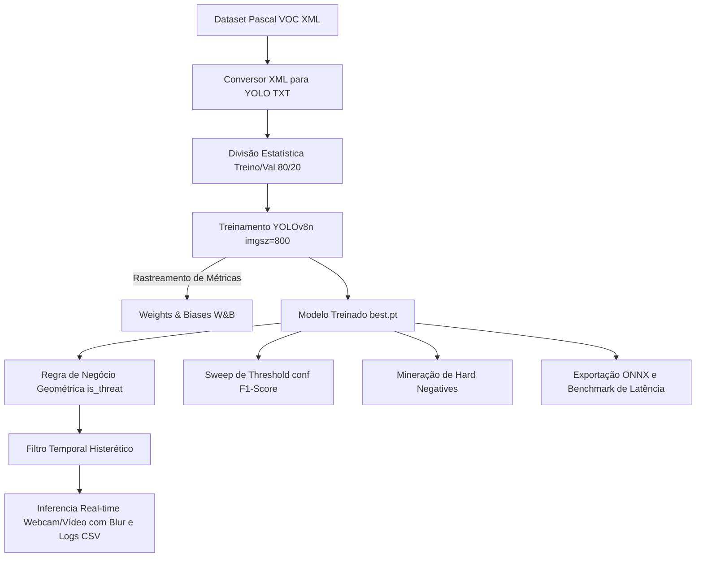

# Detecção Inteligente de Dispositivos Móveis e Classificação de Ameaças em Tempo Real via Algoritmo YOLOv8 e Filtragem Histerética Temporal

[](https://www.python.org/)
[](https://github.com/ultralytics/ultralytics)
[](https://wandb.ai/)
[](https://onnx.ai/)

Este repositório apresenta o desenvolvimento de um pipeline completo de Visão Computacional voltado para a detecção de telefones celulares e a classificação automática de situações de risco (*THREAT* ou Ameaça) em fluxos de vídeo. O projeto evolui as abordagens convencionais de inferência frame a frame ao introduzir filtragem temporal baseada em histerese para mitigação de oscilações (*flickering*), avaliação robusta por meio de varredura (*sweep*) de limiar e estratégias de mineração de exemplos difíceis (*hard negatives*), preparando o modelo para aplicações de nível de produção e validação acadêmica.

---

## 1. Introdução e Contextualização Científica

Em ambientes controlados de alta segurança (tais como salas de avaliação acadêmica, laboratórios de pesquisa corporativos, postos de operação industrial ou condução veicular), a utilização não autorizada de dispositivos móveis constitui uma violação de conformidade e um vetor de vazamento de dados ou acidentes.

Os métodos tradicionais baseados em classificadores estáticos apresentam duas limitações críticas:
1. **Falta de Contexto Espacial**: A mera presença de um smartphone (por exemplo, pousado sobre uma mesa) não caracteriza necessariamente um uso ativo ou uma infração.
2. **Instabilidade Temporal**: Variações na iluminação, oclusões parciais ou desfoques de movimento geram detecções intermitentes (falsos positivos e falsos negativos consecutivos de curtíssima duração), o que inviabiliza o acionamento de alarmes ou o bloqueio físico de telas devido ao alto nível de ruído visual.

Este projeto resolve ambas as limitações propondo uma arquitetura de duas camadas:
*   **Camada de Detecção e Heurística Geométrica**: Um detector baseado em aprendizado de máquina (YOLOv8) localiza a classe `mobile_phone`. Em seguida, regras baseadas nas proporções espaciais da caixa delimitadora (*bounding box*) determinam se o dispositivo está em posição de uso ativo (Ameaça).
*   **Camada de Filtro Temporal Histerético**: Uma janela deslizante analisa o histórico recente de predições, exigindo consistência estatística antes de alterar o estado de alerta do sistema (bloqueio da tela por borramento).

---

## 2. Estrutura do Repositório

O repositório está organizado nos seguintes notebooks e arquivos fundamentais:

*   [AP2_Visão_Computacional_Detecção_de_Telefones.ipynb](./AP2_Visão_Computacional_Detecção_de_Telefones.ipynb): **Notebook principal (Versão Atual - AP2)** contendo o pipeline expandido: integração com Weights & Biases (W&B), otimização de threshold via F1-Score, filtragem temporal com histerese, coleta ativa de *hard negatives* e exportação com benchmark ONNX.
*   [AP1_Visão_Computacional_Detecção_de_Telefones.ipynb](./AP1_Visão_Computacional_Detecção_de_Telefones.ipynb): Notebook de desenvolvimento da primeira fase (AP1), contendo a lógica preliminar e o protótipo inicial do modelo.
*   [Collab_AP1_COMPUTER_VISION_Detecção_de_Telefones_Breno.ipynb](./Collab_AP1_COMPUTER_VISION_Detecção_de_Telefones_Breno.ipynb): Versão alternativa e colaborativa focada nos experimentos iniciais do grupo.
*   `README.md`: Documentação científica e guia de reprodutibilidade do projeto.

---

## 3. Arquitetura do Pipeline

A figura abaixo descreve conceitualmente o fluxo de dados desde a preparação dos dados brutos até a execução em tempo real e benchmark:



---

## 4. Metodologia e Preparação de Dados

### 4.1. Conversão e Normalização de Anotações
O dataset original encontra-se rotulado no formato Pascal VOC, em que as coordenadas de delimitação de objetos são absolutas em relação aos pixels da imagem: `(xmin, ymin, xmax, ymax)`.

Para a alimentação eficiente da rede YOLOv8, estas coordenadas são normalizadas para valores reais no intervalo `[0.0, 1.0]`, em termos de centro do retângulo `(xc, yc)`, largura (`w`) e altura (`h`), por meio das equações:

```text
xc = (xmin + xmax) / (2 * W_imagem)
yc = (ymin + ymax) / (2 * H_imagem)
w = (xmax - xmin) / W_imagem
h = (ymax - ymin) / H_imagem
```

A função Python `convert_voc_to_yolo` (definida em [AP2_Visão_Computacional_Detecção_de_Telefones.ipynb](./AP2_Visão_Computacional_Detecção_de_Telefones.ipynb)) implementa este cálculo mitigando divisões por zero ou estouros de limites.

### 4.2. Divisão e Particionamento de Dados
A estruturação do dataset segue a divisão padrão para aprendizado de máquina supervisionado. Com uma semente de pseudorrandomização fixa (`random.seed(42)`), as imagens e suas respectivas anotações convertidas em arquivos `.txt` são distribuídas na seguinte proporção:
*   **Treinamento (80%)**: Utilizado para o ajuste de pesos dos parâmetros do modelo.
*   **Validação (20%)**: Utilizado para o monitoramento de sobreajuste (*overfitting*) e validação de métricas de generalização.

---

## 5. Configurações e Treinamento do Modelo

### 5.1. Seleção da Rede Neural
Adota-se a arquitetura **YOLOv8n** (YOLOv8 Nano), que possui aproximadamente 3.2 milhões de parâmetros. Esta escolha se justifica pelo foco em dispositivos de borda ou execução em CPU em tempo real, onde uma baixa latência computacional é prioritária em relação a backbones massivos.

### 5.2. Hiperparâmetros de Treinamento (Fase AP2)
Comparado à fase AP1 (que empregava resolução padrão de 640 pixels), a fase AP2 adota hiperparâmetros otimizados para melhoria do mAP em objetos de escala reduzida:

*   **Tamanho de imagem (`imgsz`)**: `800 x 800` pixels. Aumentar a escala de entrada de 640 para 800 melhora a precisão na detecção de celulares posicionados a maiores distâncias em relação à câmera.
*   **Épocas de Treinamento (`epochs`)**: `30`.
*   **Tamanho do lote (`batch`)**: `16` amostras por iteração.
*   **Modelo Base**: `yolov8n.pt` (transfer learning a partir do dataset MS COCO).

### 5.3. Integração com Weights & Biases (W&B)
Durante a fase de otimização, o pipeline estabelece comunicação automática com o painel do **Weights & Biases**. Isso permite o monitoramento síncrono das funções de perda (*box loss*, *class loss* e *dfl loss*) e das curvas de precisão-revocação na nuvem, garantindo auditoria completa do comportamento do modelo durante as 30 épocas.

---

## 6. Heurística Geométrica de Classificação de Ameaça (Regra de Negócio)

Após o YOLOv8 retornar as caixas delimitadoras de celulares detectados, cada caixa passa por uma verificação de regras geométricas descritas na função `is_threat` (disponível em [AP2_Visão_Computacional_Detecção_de_Telefones.ipynb](./AP2_Visão_Computacional_Detecção_de_Telefones.ipynb)). O objetivo é isolar celulares que estão sendo ativamente empunhados e visualizados pelo usuário.

Seja a caixa delimitadora definida pelas coordenadas absolutas `(x1, y1)` e `(x2, y2)` em uma imagem de resolução `W x H`:

1.  **Centroide da Bounding Box**:
    ```text
    cx = (x1 + x2) / 2
    cy = (y1 + y2) / 2
    ```
2.  **Área da Bounding Box**:
    ```text
    Area_box = (x2 - x1) * (y2 - y1)
    ```
3.  **Proporção de Área Relativa**:
    ```text
    Ratio_area = Area_box / (W * H)
    ```
4.  **Razão de Aspecto (Aspect Ratio)**:
    ```text
    Ratio_aspect = (y2 - y1) / max(x2 - x1, 1)
    ```

A classificação retorna `True` (Ameaça) se e somente se as seguintes **quatro restrições** forem atendidas de forma simultânea:

*   **Centração Horizontal (Foco Central)**: `0.30 * W <= cx <= 0.70 * W`
*   **Proporção de Área Mínima (Proximidade)**: `Ratio_area >= 0.03`
*   **Limite Vertical (Elevação)**: `cy <= 0.85 * H` (Garante que o celular não está em superfícies baixas, como mesas, e sim no campo de visão ativa)
*   **Orientação em Retrato (Modo Ativo)**: `Ratio_aspect >= 1.2` (Smartphone posicionado verticalmente)

Se qualquer condição falhar, o objeto detectado permanece como uma detecção comum de celular segura (`mobile_phone`).

---

## 7. Sistema de Filtragem Histerética Temporal

Para eliminar o falso acionamento decorrente do *flickering* do detector, implementou-se o algoritmo `TemporalThreatFilter` operando em janela deslizante de decisões de tamanho fixo `N = 20`.

### 7.1. Funcionamento do Filtro
Seja `xt` a saída da heurística geométrica de ameaça no frame `t` (`1` para ameaça ativa, `0` para caso contrário). A janela deslizante mantém o histórico recente de predições:

```text
W_t = {x_t-N+1, ..., x_t}
```

O **Score Temporal** (`S_t`) no instante `t` é a média da janela:

```text
S_t = soma(W_t) / N
```

O estado final do alerta de travamento (`A_t` de 0 ou 1) é governado por uma lógica de transição com **histerese**:

*   **Ativação do Alerta** (`A_t = 1`): Ativado quando `S_t >= 0.60` (pelo menos 60% dos frames na janela contêm ameaças).
*   **Liberação do Alerta** (`A_t = 0`): Desativado quando `S_t < 0.30` (densidade de ameaças cai abaixo de 30%).
*   **Manutenção**: Se `0.30 <= S_t < 0.60`, o estado anterior se mantém (`A_t = A_t-1`).

Essa estratégia mitiga oscilações bruscas decorrentes de frames isolados com falha de detecção.

### 7.2. Ação de Segurança e Registro de Evidências
Quando o alerta está ativo (`A_t = 1`):
1.  **Obscurecimento Visual**: Aplica-se um filtro gaussiano de desfoque com kernel `99 x 99` e desvio padrão `sigma = 30` em todo o frame, seguido pela mistura com um canal preto translúcido para diminuir a visibilidade:
    ```text
    Frame_saida = 0.5 * Blur(Frame, 99) + 0.5 * Overlay_preto
    ```
2.  **Mensagens Visuais**: São inseridos avisos de "TELA BLOQUEADA" e "CELULAR DETECTADO" no centro da tela.
3.  **Auditoria Automatizada**: Caso o temporizador de *cooldown* (padrão: 45 frames) esteja zerado, o frame de evidência é persistido em disco e um log de evento é anexado a um arquivo CSV (`threat_events.csv`), contendo índice do frame, timestamp, score temporal, confiança máxima e caminho da imagem.

---

## 8. Avaliação Robusta e Otimização de Limiar (Sweep)

O projeto realiza duas etapas de validação para garantir a precisão científica dos resultados de detecção.

### 8.1. Métricas Globais Oficiais
Utilizando a API `model.val()` do Ultralytics no conjunto de dados de validação, extraem-se as seguintes métricas a um limiar padrão (IoU de intersecção a 0.6):
*   **mAP@50**: Precisão Média Média a IoU fixo de 0.5.
*   **mAP@50-95**: Média aritmética de mAP variando o IoU de 0.5 a 0.95 com passo de 0.05.
*   **Precision (Precisão)**: Proporção de detecções positivas corretas.
*   **Recall (Revocação/Sensibilidade)**: Proporção de objetos reais detectados com sucesso.

### 8.2. Otimização do Limiar de Confiança via F1-Score (Sweep)
Para encontrar o equilíbrio ótimo entre falsos positivos e falsos negativos, a função `evaluate_thresholds` (em [AP2_Visão_Computacional_Detecção_de_Telefones.ipynb](./AP2_Visão_Computacional_Detecção_de_Telefones.ipynb)) faz um varrimento de thresholds de confiança variando de `0.10` a `0.95` com intervalos discretos de `0.05`.

Para cada valor de limiar de confiança, as caixas preditas são cruzadas com as anotações reais do conjunto de validação. Uma predição é rotulada como **Verdadeiro Positivo (TP)** se seu `IoU >= 0.5` com um rótulo real não utilizado. Predições sobressalentes geram **Falsos Positivos (FP)**, e rótulos reais não emparelhados tornam-se **Falsos Negativos (FN)**.

Com base nestes valores, o notebook computa o perfil de F1-Score e seleciona automaticamente o limiar de confiança ótimo que maximiza o F1-Score:

```text
F1_Score = 2 * (Precision * Recall) / (Precision + Recall)
```

---

## 9. Mineração Ativa de Hard Negatives

Com vistas ao aprendizado contínuo do modelo, desenvolveu-se a função `collect_hard_negatives` (em [AP2_Visão_Computacional_Detecção_de_Telefones.ipynb](./AP2_Visão_Computacional_Detecção_de_Telefones.ipynb)).

Ela analisa imagens do conjunto de validação que **não contêm anotações originais** de celular (imagens vazias para a classe avaliada). Se o modelo YOLOv8 realizar uma detecção com confiança superior a um limiar específico (ex: 0.35) nessa imagem, isso é categorizado como um **Falso Positivo de alta confiança** (exemplo difícil ou *Hard Negative*).

Essas imagens de erro são isoladas e salvas em uma pasta `/content/hard_negatives`. Em ciclos de refinamento do artigo, elas devem ser integradas ao conjunto de treino sem anotações (arquivos `.txt` vazios correspondentes), instruindo explicitamente a rede a mitigar predições errôneas sob contextos de fundo semelhantes.

---

## 10. Exportação ONNX e Benchmark de Latência

Buscando independência do framework PyTorch em ambientes de produção, o modelo treinado é exportado para o formato aberto **ONNX** (Open Neural Network Exchange), utilizando simplificação de grafo (`simplify=True`) e suporte a dimensões de lote dinâmicas (`dynamic=True`):

```python
onnx_path = best_model.export(format="onnx", dynamic=True, simplify=True)
```

O pipeline avalia de forma quantitativa a performance comparativa executando um teste de estresse nas primeiras 100 imagens de validação. Computam-se:
*   **Latência Média por Frame** em milissegundos.
*   **Latência no Percentil 95 (p95)**, métrica crítica para garantir a ausência de gargalos de processamento esporádicos.
*   **Frames Por Segundo Estimados (FPS)**: `FPS = 1000 / Latencia_Media`.

Se o hardware local disponibilizar drivers adequados, o notebook realiza a comparação automatizada via terminal através do comando:

```bash
yolo benchmark model=runs/mobile_phone_detector/weights/best.pt imgsz=800 half=False data=mobile_phone_yolo/data.yaml device=cpu
```

---

## 11. Instruções para Reprodutibilidade e Execução

### 11.1. Execução via Google Colab (Recomendado)
1.  Faça o upload do notebook [AP2_Visão_Computacional_Detecção_de_Telefones.ipynb](./AP2_Visão_Computacional_Detecção_de_Telefones.ipynb) para o seu ambiente do Google Drive.
2.  Garanta que os arquivos compactados do seu conjunto de dados (`100_imagens_celulares.zip`, `520_imagens_celulares.zip` ou `1300_imagens_celulares.zip`) estejam carregados no diretório `/content`.
3.  Execute as células sequencialmente. Ao atingir o treinamento, siga o prompt de autenticação do Weights & Biases para salvar as estatísticas de validação em sua conta.
4.  Após a conclusão, os arquivos de resultados e logs estarão disponíveis em `/content/threat_evidence` e `/content/threat_events.csv`.

### 11.2. Execução em Ambiente Local (Webcam ativa)
Para rodar o pipeline de detecção em tempo real consumindo a webcam física do seu computador:

1.  Clone o repositório localmente.
2.  Instale os pré-requisitos necessários via terminal:
    ```bash
    pip install ultralytics opencv-python numpy pandas matplotlib seaborn scikit-learn onnx onnxruntime
    ```
3.  Abra o notebook em seu ambiente local (Jupyter Notebook ou VS Code) e altere a chamada de predição do Colab para a sua câmera local nas últimas células executáveis:
    ```python
    from ultralytics import YOLO
    
    # Carregue o modelo treinado local
    model = YOLO("caminho/para/seu/best.pt")
    
    # Executa detecção com webcam local (source=0)
    run_realtime_detection(model, source=0, conf_thr=0.35)
    ```

---

## 12. Saídas e Resultados do Pipeline

Durante e após a execução do pipeline de processamento da AP2, são criados os seguintes artefatos:

*   **`best.pt` e `best.onnx`**: Pesos binários do modelo treinado otimizado nos formatos nativos PyTorch e ONNX, respectivamente.
*   **`threat_detection_results/`**: Amostras de validação estáticas rotuladas com as marcações de segurança `SAFE` ou `THREAT` e desfoque gaussiano de tela.
*   **`threat_realtime_output.mp4`**: Gravação em vídeo do fluxo processado apresentando a sobreposição do alerta temporal histerético e a ocultação da tela sob alta probabilidade de infração.
*   **`threat_evidence/`**: Capturas de tela dos instantes de infração detectados (organizados de forma sequencial com índice de frame).
*   **`threat_events.csv`**: Base de dados em planilha de eventos, contendo o log estruturado para auditorias científicas do detector de celulares.
*   **`hard_negatives/`**: Conjunto de imagens salvas para o ciclo subsequente de retreinamento do detector.

---

## 13. Conclusão e Autoria

Este ecossistema foi desenvolvido como parte integrante das atividades práticas de **Visão Computacional** (**AP2**), servindo como fundamentação experimental e metodológica para a redação de artigos científicos na subárea de segurança inteligente baseada em aprendizagem profunda.

*Desenvolvido para fins de validação acadêmica e pesquisa em Visão Computacional aplicada.*
